# Wardenix

**An identity, endpoint, and network security engineering platform.**

Wardenix provisions and secures a simulated organization end to end: identity architecture on Microsoft Entra ID, an isolated endpoint under real attack, a network security stack watching both, and an AI-assisted response layer tying it together. Every control exists because a specific threat justified it.

> Part of the **Nullfront** project family.

---

## The problem this solves

Identity is the most common initial access vector in modern breaches, and most organizations run it with either too little control (no PIM, no risk-based policy) or too much friction (blanket premium licensing, no scoping). Endpoints and networks are usually defended by separate teams using separate tools that rarely correlate. Wardenix is a working answer to both - one person designing identity governance, endpoint defence, and network detection as a single coherent system, and proving it works by attacking it.

## What this project demonstrates

| Capability | Discipline |
|---|---|
| Identity architecture as code (Microsoft Graph API, PowerShell SDK) | Security Engineering |
| Conditional Access, PIM, and Identity Governance design | Security Engineering |
| Isolated endpoint provisioning and hardening | Security Engineering |
| Network security architecture (firewall design across three layers) | Security Engineering |
| Risk assessment and vulnerability lifecycle management | Security Analysis |
| Identity Protection risk investigation | Security Analysis |
| Multi-engine detection correlation (cloud + endpoint + network) | Security Analysis |
| SOAR playbook design and AI-assisted triage | DevSecOps |
| Secure scripting and CI-gated automation | DevSecOps |
| Threat modelling (STRIDE + ATT&CK across four domains) | Both |

## Architecture

Full system design and data flow: **[docs/architecture.md](docs/architecture.md)**

## Threat model

Every control traces back to an identified threat, across identity, endpoint, network, and AI: **[docs/threat-model.md](docs/threat-model.md)**

## The simulated organization

26 fictional accounts across departments, split by licensing tier deliberately - most run on Entra ID's free baseline, a small privileged subset runs on Premium P2. That split is itself a design decision, not a shortcut: licensing only where the capability is actually needed.

| Tier | Count | Roles |
|---|---|---|
| Entra ID Free (Security Defaults) | 20 | Marketing, Sales, Procurement, general staff, contractors |
| Entra ID P2 | 6 | 2 IT Admins (PIM-eligible), CEO, CFO, HR Lead, Break-Glass Admin |

## Technology stack

| Layer | Tool |
|---|---|
| Identity | Microsoft Entra ID (P2), Graph API, Graph PowerShell SDK |
| Endpoint | Local isolated VM (Tiny10), Wazuh agent |
| Network security | Wazuh manager, Suricata, NPS/RADIUS, Wireshark |
| Adversary emulation | Metasploit Framework |
| Detection-as-code | Sigma, KQL |
| Log pipeline | Azure Log Analytics, Grafana Cloud, Azure Monitor Workbooks |
| SOAR | Shuffle (self-hosted) |
| Alerting & notifications | Slack (via Grafana Alerting) |
| AI-assisted triage | Google Gemini API |
| Infrastructure-as-Code | OpenTofu |
| Automation & CI | GitHub Actions, Python, PowerShell |

## Design principle: the host machine is never part of the lab

Every VM in this project runs on isolated virtual networking with no path back to the machine building it. This isn't incidental - it's a deliberate boundary documented and enforced before any attack tooling runs. Detail in the architecture doc's trust boundaries section.

## Roadmap

- [x] **Phase 0 - Foundation:** threat model, architecture, organization design
- [x] **Phase 1 - Identity Engineering:** users, groups, and governance as code
#### Phase 1 - 26 users and 11 dynamic groups, provisioned entirely via Microsoft Graph API

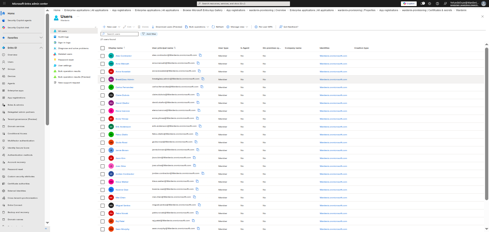
- [x] **Phase 2 — Endpoint:** isolated provisioning, Entra device registration (Wazuh agent deferred to Phase 3 — requires a live manager to connect to)

#### Phase 2 — Isolated endpoint, verified network boundaries, cloud-trust registered

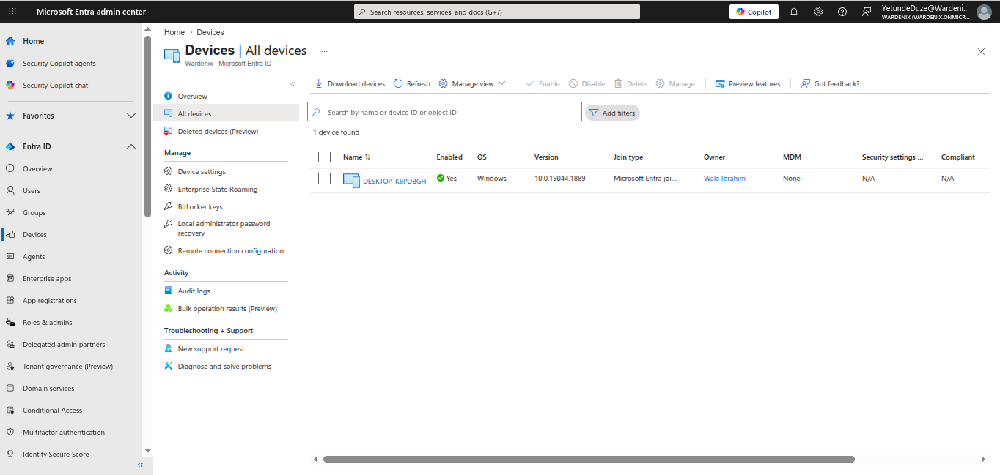
- [x] **Phase 3 - Network Security Architecture:** management infrastructure, firewall design

#### Phase 3 — Management infrastructure, network detection, and SOAR

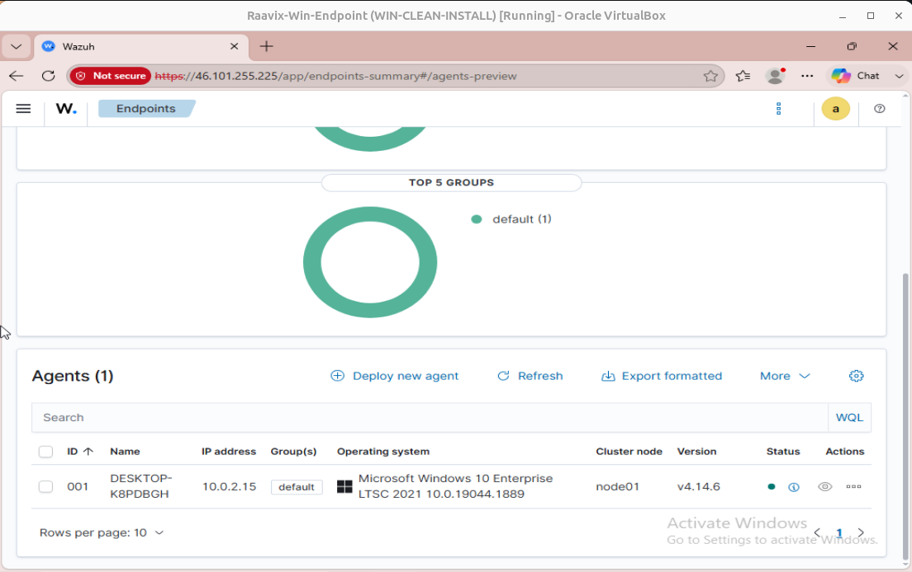

Built the cloud management infrastructure — the detection and response platform
everything in Phase 4 reports into.

- Management droplet provisioned via OpenTofu on DigitalOcean (Frankfurt, s-2vcpu-4gb, Ubuntu 24.04)
- Cloud firewall built rule-by-rule: SSH (22), Wazuh agent data (1514), enrollment (1515), dashboard (443), Shuffle SOAR (3443)
- **Wazuh 4.14.6** (manager, indexer, dashboard) — Wale Ibrahim's endpoint confirmed active
- Critical fix documented: port 1515 (enrollment) was initially missing — agent started locally but never registered; added and verified
- **Suricata 8.0.6** installed from OISF PPA — HOME_NET corrected from private-LAN default to actual droplet IPs; 52,058 Emerging Threats Open rules loaded; alerting verified via testmyids.com
- **FreeRADIUS 3.2.5** — test user authenticating; real RADIUS traffic captured and analyzed in Wireshark
- **Shuffle SOAR** (self-hosted via Docker) — survived a hard OpenSearch bootstrap bug where the password hash was not written despite a success message; fixed by bypassing the broken installer and writing the hash directly via securityadmin.sh
- Configuration docs committed: `infra/suricata-configuration.md`, `infra/freeradius-configuration.md`, `infra/shuffle-configuration.md`

- [x] **Phase 4 - Attack, Risk Assessment & Hardening:** baseline compromise, risk register, remediation, re-test

#### Phase 4 — Attack, risk assessment, and hardening

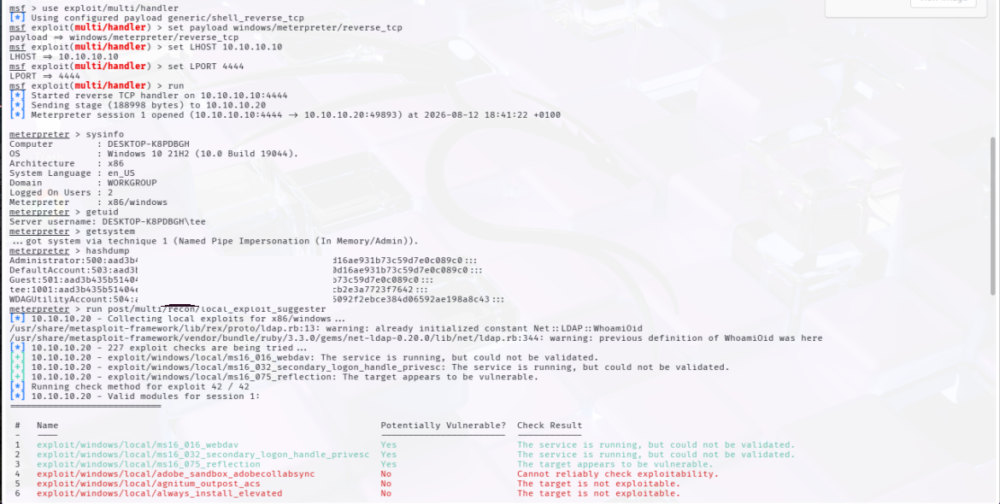
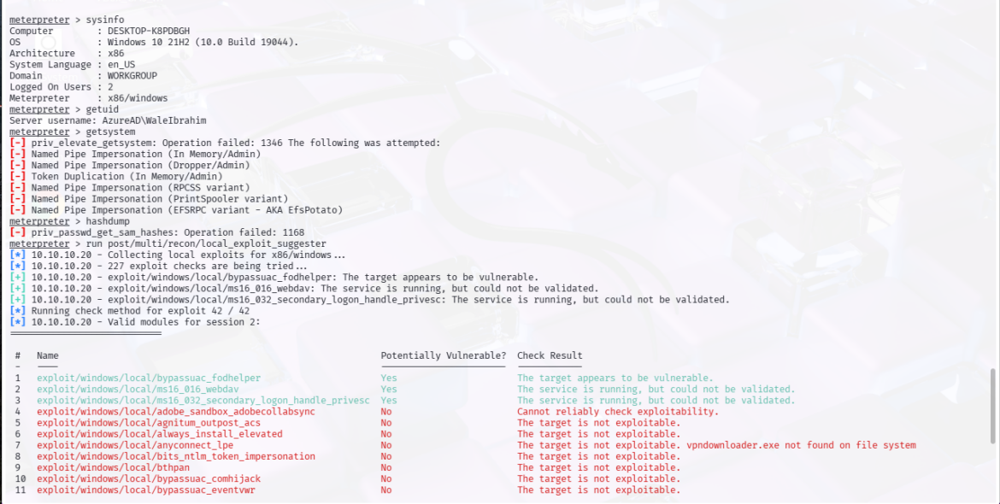

Attacked the unhardened endpoint, formally risk-registered every finding, hardened, then re-tested to measure genuine risk reduction. Attack before harden — always.

**Baseline attack sequence:**
- Static IPs assigned: kalip (attacker) = `10.10.10.10`, endpoint (target) = `10.10.10.20`
- Payload: `windows/meterpreter/reverse_tcp`, delivered via HTTP and user execution (T1204.002)
- Two sessions compared:
  - **`tee` (local account):** `getsystem` succeeded immediately via Named Pipe Impersonation → SYSTEM. All 5 local account hashes dumped. `bypassuac_fodhelper`: already elevated.
  - **`AzureAD\WaleIbrahim` (Entra standard user):** `getsystem` failed across all 6 techniques. `hashdump` blocked. `bypassuac_fodhelper`: not in admins group. Meaningfully more contained blast radius.
- 3 CVEs flagged by `local_exploit_suggester`: `ms16_016`, `ms16_032`, `bypassuac_fodhelper`

**Risk register — 7 findings:** `docs/risk-register.md`

| Risk | Severity | Finding |
|---|---|---|
| RISK-01 | Critical | No endpoint protection — payload executed silently |
| RISK-02 | Critical | Local account escalated to SYSTEM immediately |
| RISK-03 | Critical | All 5 local account hashes dumped from SAM |
| RISK-04 | High | 3 unpatched local privilege escalation CVEs |
| RISK-05 | Informational | Entra standard user: privilege escalation blocked (positive) |
| RISK-06 | High | `tee` account already in elevated state |
| RISK-07 | Informational | Zero remote-service attack surface (positive) |

**Hardening applied:**
- Windows Defender real-time protection policy set via registry (Tiny10 has no Defender GUI)
- Windows Updates applied: KB5120249 + KB5121646 — confirmed up to date
- `tee` removed from Administrators; `wardenix-admin` created as replacement local admin

**Re-test:** same payload re-run post-hardening against both accounts. Results and updated screenshots committed.

- [x] **Phase 5 - Baseline Protection:** Security Defaults across the free tier

#### Phase 5 — Baseline protection: Security Defaults

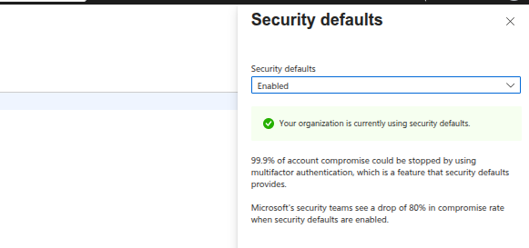

Confirmed and documented the free-tier identity baseline active across all 26 accounts.

- Security Defaults was enabled automatically by Microsoft at tenant creation (confirmed August 2026)
- Enforces: MFA registration for all users, mandatory admin MFA, risk-based user MFA challenges, legacy authentication blocked, device code flow blocked
- Documented Security Defaults vs. Conditional Access trade-offs — Security Defaults is the correct free-tier tool; Phase 6 replaces it with granular CA policies for the 6 P2-licensed accounts

- [x] **Phase 6 - Conditional Access Engineering:** tiered policy design

#### Phase 6 - Conditional Access Engineering

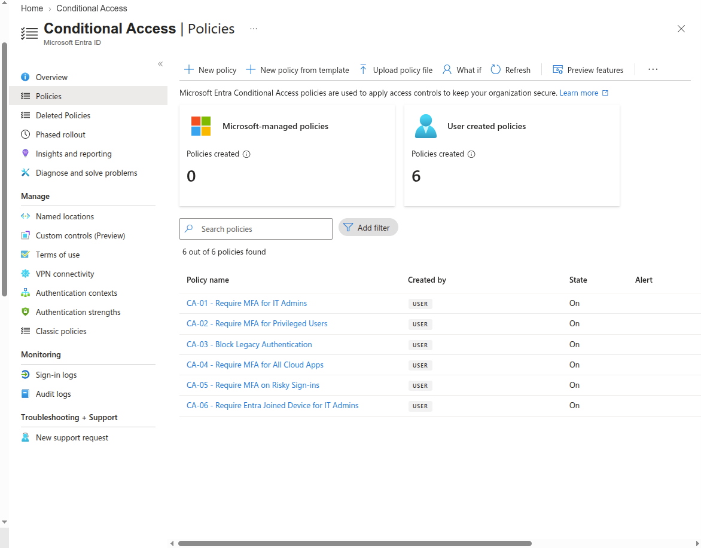

Replaced Security Defaults with six scoped CA policies for the 6 P2-licensed accounts. Free-tier 20 users remain under Security Defaults.

- CA-01: MFA required for IT Admins (Wale, Mei) on all resources
- CA-02: MFA required for privileged users (David, Sofia, Ama) on all resources
- CA-03: Legacy authentication blocked - Exchange ActiveSync and Other clients only
- CA-04: MFA required for all 6 P2 users across all cloud apps
- CA-05: MFA step-up on medium and high risk sign-ins (P2 Identity Protection signal)
- CA-06: Entra-joined device required for IT Admin access - enforces DESKTOP-K8PDBGH as the only trusted endpoint
- All policies validated in Report-only mode via What If tool before enabling; BreakGlass Admin excluded from every policy
- Additional finding: CA-06 confirmed blocking SOC PC (non-Entra-joined) with AADSTS9001011 - device trust enforced
- KQL validated in Defender portal: CA-01 visible in ConditionalAccessPolicies field, MFA enforcement rate and CA status distribution queryable across sign-in events
- Grafana Cloud connected to wardenix-sentinel via Azure Monitor (App Registration: wardenix-grafana) - Wardenix Security Operations dashboard live with 4 panels
- Live findings: 54% MFA / 46% single-factor after PIM activation; CA policy status notApplied on SOC PC confirms CA-06 working correctly
- Entra diagnostic settings streaming to wardenix-sentinel: SignInLogs, NonInteractiveUserSignInLogs, AuditLogs, RiskyUsers, UserRiskEvents

- [x] **Phase 7 - Privileged Identity Management:** eligible roles, approval workflow

#### Phase 7 - Privileged Identity Management

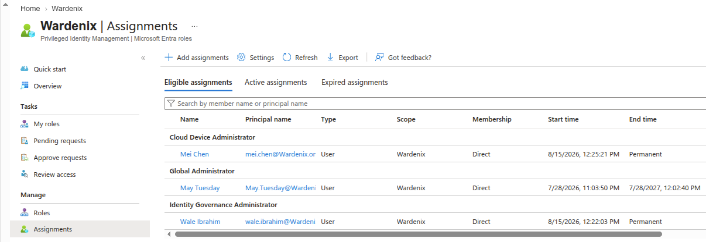

Just-in-time privileged access replaced standing admin rights for both IT Admin accounts. It was then extended to group membership via PIM for Groups.

- Wale Ibrahim: Identity Governance Administrator (eligible) - approver: Mei Chen
- Mei Chen: Cloud Device Administrator (eligible) - approver: Wale Ibrahim
- Role settings: 1-hour max activation, Azure MFA required, justification required, approval required
- Activation workflow validated end-to-end: request → MFA → peer approval → time-bound active role → auto-expiry confirmed
- Additional finding: CA-06 confirmed blocking sign-in from non-Entra-joined device (AADSTS9001011)
- PIM for Groups: Wardenix IT Admins PIM group onboarded - Wale and Mei eligible for group membership (static group, 1-year eligible, MFA + approval required)
- Graph API PIM query script (identity/pim_query.py): queries eligible assignments and self-activation history via Microsoft Graph - confirmed returning 3 eligible assignments and 2 activation events with justifications

- [x] **Phase 8 - Identity Protection:** risk detection and investigation

#### Phase 8 - Identity Protection: Risk Detection and Investigation

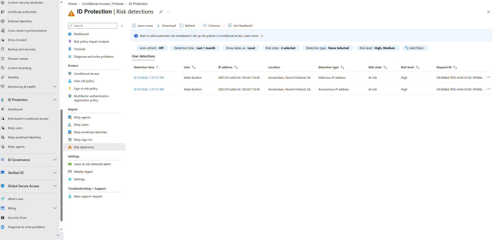

Configured risk-based CA, simulated Tor browser attack, investigated detections across all ID Protection reports, remediated, and documented the full investigation workflow.

- CA-05: MFA step-up on medium/high risk sign-ins (Phase 6)
- CA-07: Require risk remediation (MFA + password change) on high user risk - added Phase 8
- Attack simulation: Tor browser sign-in as Wale Ibrahim triggered Anonymous IP + Malicious IP detections simultaneously - smart lockout fired before password entry (error 50053)
- 12 risk events captured in AADUserRiskEvents (Log Analytics) from second Tor session - realtime detection confirmed
- Investigation workflow documented: Detect → Investigate → Decide → Remediate
- KQL queries: risk events by type/level, high-risk users at risk, full risk column analysis
- Grafana Identity Risk Events panel confirmed live with 12 events from Tor simulation

- [x] **Phase 9 - Identity Governance:** Access Reviews, Entitlement Management

#### Phase 9 - Identity Governance

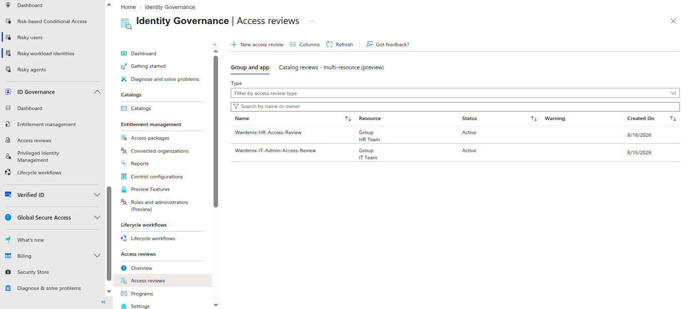

Recurring oversight layer - access reviews, entitlement management, terms of use, and identity secure score baseline.

- Access Review 1: Wardenix-IT-Admin-Access-Review - IT Team group, quarterly, 14-day window, YetundeDuze as reviewer, auto-remove on no response
- Access Review 2: Wardenix-HR-Access-Review - HR Team group, monthly, 7-day window, Mei Chen as reviewer (peer review, not self-review), auto-remove on no response
- Access Package: IT Admin Access Package - wardenix-provisioning app, admin-assigned only, 1-year expiry, quarterly access review built in
- Terms of Use: Wardenix IT Admin Terms of Use created (5-point acceptable use policy) - attachment to access package blocked by Entra ID Governance licence requirement; documented as design decision
- Identity Secure Score baseline captured (8/18/2026) - to be tracked at each phase boundary
- Lifecycle Workflows (Joiner/Mover/Leaver automation via Python/Graph API) designed but requires Entra ID Governance licence - architectural design documented

- [x] **Phase 10 - Log Pipeline & Multi-Engine Analysis:** correlation across all sources

#### Phase 10 - Log Pipeline & Multi-Engine Analysis

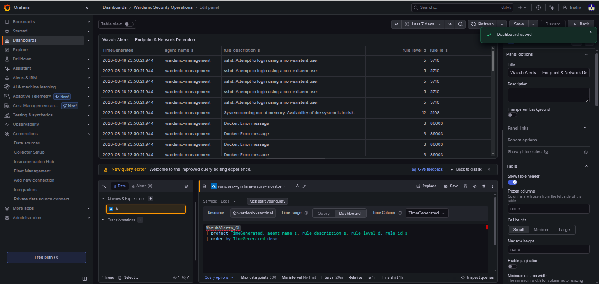

Three detection engines were unified into wardenix-sentinel Log Analytics workspace - Entra ID, Wazuh, and Defender XDR all queryable via KQL and visualized in Grafana.

- Entra ID diagnostic settings streaming 5 log types to wardenix-sentinel: SignInLogs, NonInteractiveUserSignInLogs, AuditLogs, AADRiskyUsers, AADUserRiskEvents, and ManagedIdentitySignInLogs
- Defender XDR connector auto-configured on Sentinel → Defender portal onboarding
- Wazuh → Log Analytics forwarder (infra/wazuh_to_sentinel.py): reads alerts.json, posts via HTTP Data Collector API, and cron every 15 minutes - WazuhAlerts_CL table confirmed populated
- Wazuh infrastructure fix: indexer OOM-killed July 25, fixed with 512m heap + 2GB swap; API password reset via rbac.db werkzeug scrypt
- Grafana Cloud dashboard (Wardenix Security Operations): 8 panels - MFA Enforcement Rate, CA Policy Distribution, Risky Events, PIM Role Activations, Impossible Travel, PIM Activation Anomalies, Mass Consent Grants, Wazuh Alerts (Endpoint & Network Detection)
- KQL detection queries: impossible travel, PIM activation anomalies, stale access, mass consent grants, Wazuh alert triage
- Real detections in pipeline: SSH brute force (rule 5710, level 5), memory pressure (rule 5108, level 12)

- [ ] **Phase 11 - SOAR + AI-Assisted Response:** automated playbook, incident narrative

## Getting started

Setup steps are added per phase.

---

*Maintained as a portfolio project demonstrating identity, endpoint, and network security engineering, analysis, and automation.*

