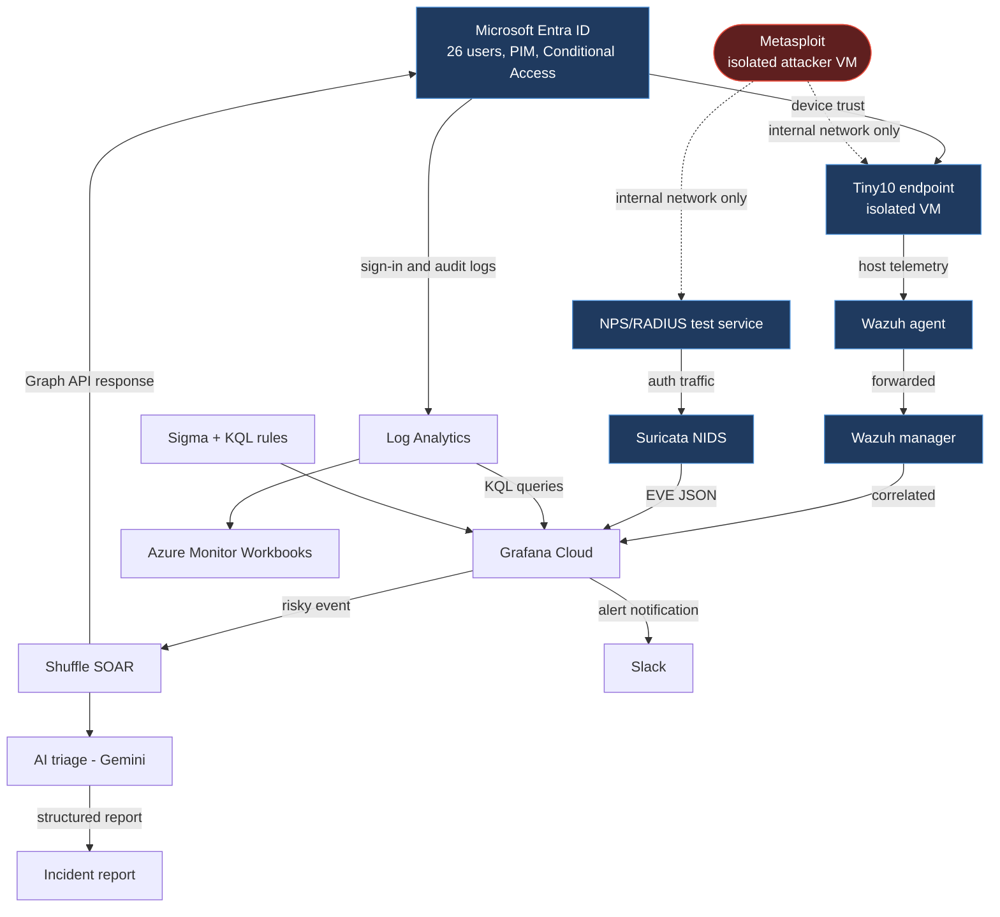

# Architecture

## Overview

Wardenix has four domains - identity, endpoint, network, and AI-assisted response - designed here as one system. Each domain owns a distinct responsibility, and every connection between them exists because a specific detection or governance need requires it, not by default.

## Data flow

## Components

| Component | Role | Phase |
|---|---|---|
| Microsoft Entra ID | Identity plane - users, groups, Conditional Access, PIM, Identity Protection, Governance | 1, 5–9 |
| Tiny10 endpoint | Isolated Windows target, device-trust-registered to an IT Admin | 2 |
| Metasploit attacker VM | Controlled adversary, isolated to internal network only | 4 |
| Wazuh manager + agent | Host and cloud-identity detection, cross-validating Entra's own risk signals | 2–4, 10 |
| NPS/RADIUS | Network authentication test service, real protocol traffic for Suricata/Wireshark | 3 |
| Suricata | Network-layer intrusion detection | 3, 10 |
| Log Analytics | Cloud-native identity and audit log store, KQL query layer | 10 |
| Grafana Cloud | Cross-domain correlation and dashboards | 10 |
| Shuffle | SOAR - automated response to correlated alerts | 11 |
| Slack | Alert notification channel, routed from Grafana Alerting | 10 |
| Gemini API | AI-assisted triage, suggests only, human approves | 11 |

## Trust boundaries

1. **Attacker VM → Endpoint / RADIUS.** The only permitted attack path, confined to an isolated internal virtual network with no route to the host machine, the internet, or any other VM.
2. **Host machine → every VM in this lab.** This is the boundary that matters most personally, not just architecturally. No Bridged or Host-Only network adapters are used anywhere in this project - every VM runs on Internal Network (VM-to-VM only) or NAT (outbound-only, never inbound). Shared folders and shared clipboard are disabled on every VM. A clean snapshot is taken before any attack tooling runs, so compromise is always reversible without touching the host.
3. **Endpoint → Entra ID.** Device trust and telemetry flow up; this is also the path an attacker would try to exploit to pivot from a compromised endpoint into privileged cloud access - which is exactly what Phase 4's risk assessment and Phase 6's device-compliance Conditional Access policy are built to test and prevent.
4. **Correlation layer → Shuffle.** Where a raw alert becomes an automated response candidate. Not every alert crosses this boundary - only ones a defined playbook is built to handle.
5. **Shuffle → Gemini API.** Alert data leaves the environment for AI enrichment. Redaction happens before anything is sent; the model suggests a response, it never executes one directly.

Each boundary maps to specific threats and controls in [threat-model.md](threat-model.md).

## Firewall design - three distinct layers

This project builds and justifies firewall rules at three separate points, each answering a different question, detailed with rule-by-rule reasoning as they're built:

1. **VM network isolation (Phase 2–4)** - which VMs can reach each other, and confirming none can reach the host
2. **Cloud firewall (Phase 3)** - what's allowed to reach the management droplet from the internet
3. **Endpoint host firewall (Phase 4)** - what the Tiny10 endpoint itself allows, tightened after the first attack sequence and re-tested
